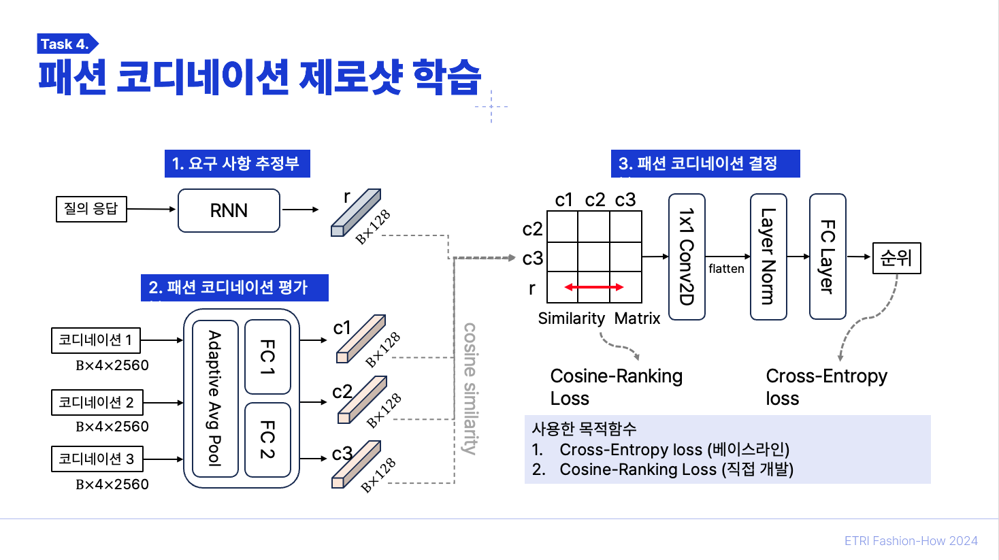
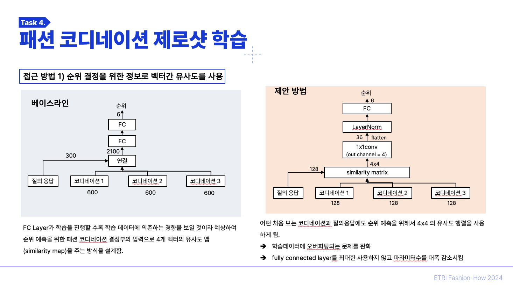
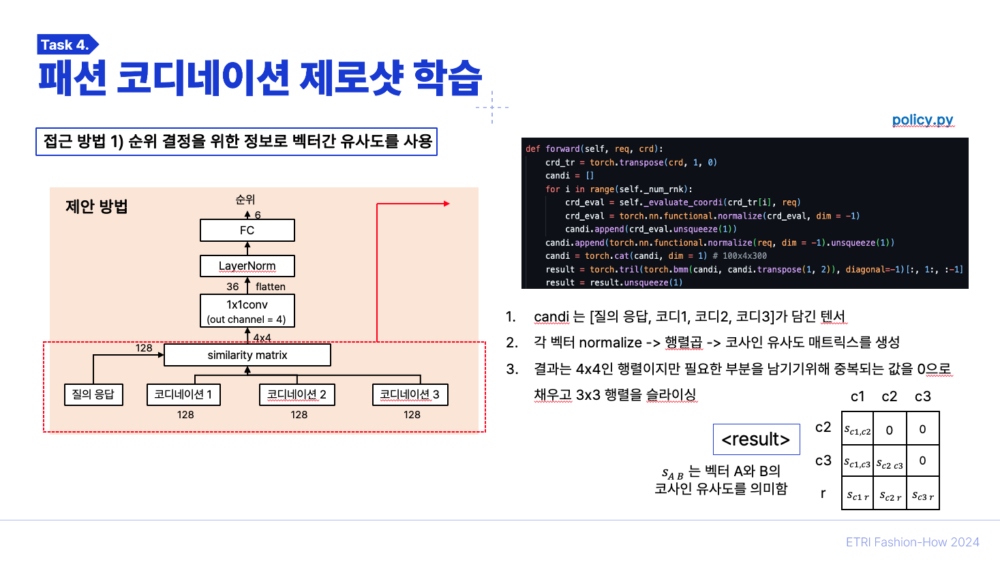
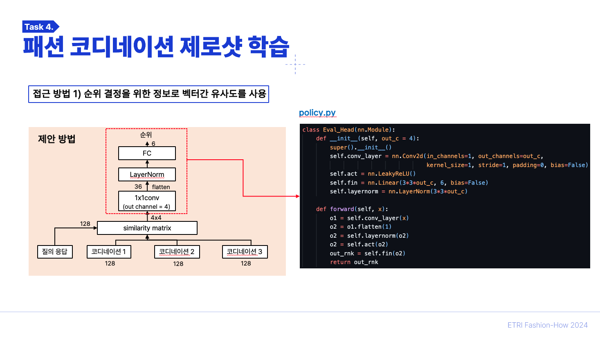
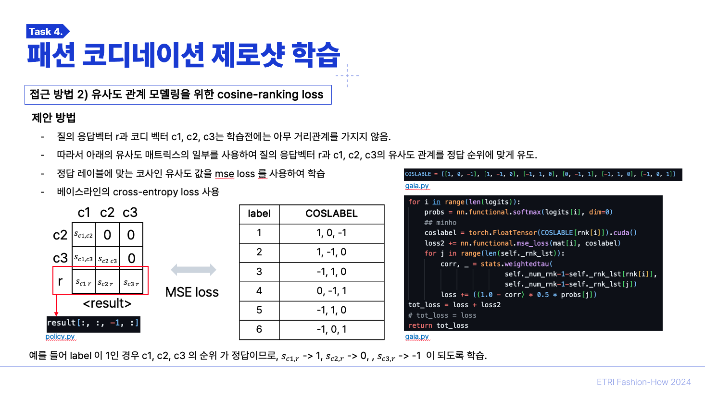
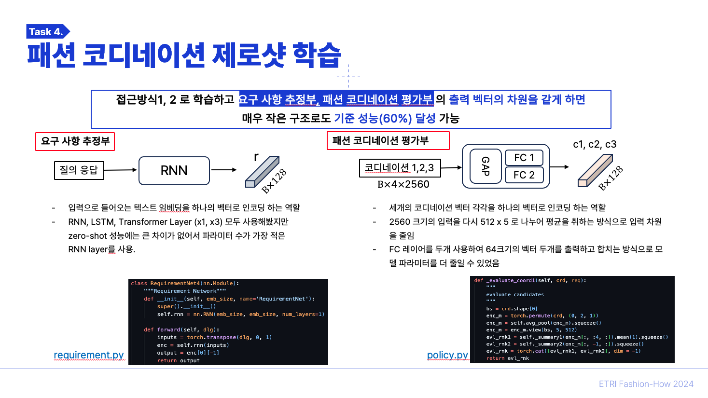
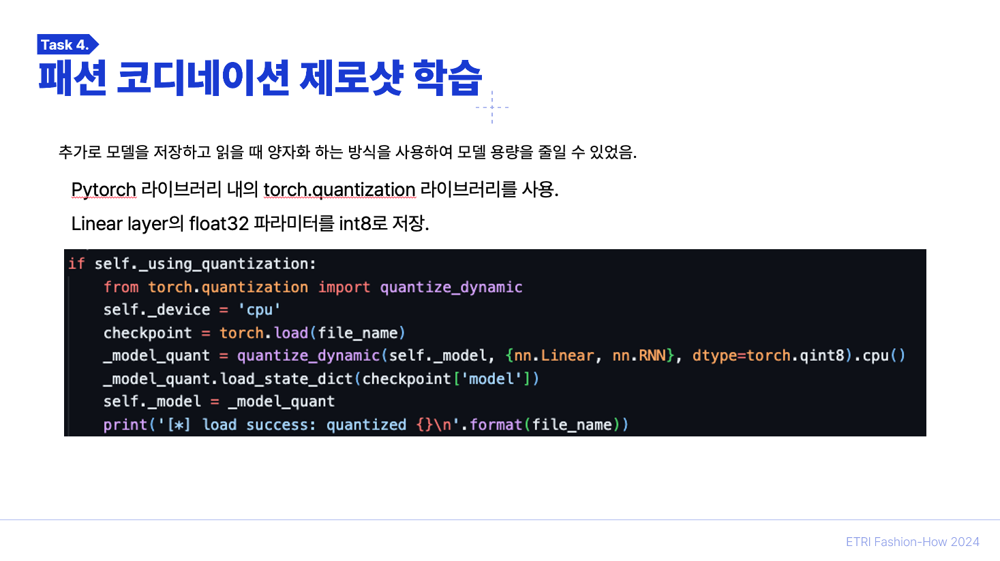

# Fashion-How-Season-5
ETRI Self-Improving AI Competition, FASHION-HOW SEASON5, Task 4(Zero-Shot Learning), 1st
2024년도 ETRI 자율성장 인공지능 경진대회 시즌5 subtask 4 에서 [1등 성능을 달성](https://fashion-how.org/Season5-task/?subTaskId=4) 한 방법 입니다. (유일하게 기준 성능을 넘기고 제출 성공)

### Result
모델의 제로샷 성능 Validation **70%**, Test **69.28%** 를 달성하였고 모델 용량은 **203.9kB** (베이스라인 모델 863.4MB) 를 달성하였습니다. 
___
### Task 개요
Sub-Task4 Zero-Shot Learning은 패션 코디네이션 3가지가 주어졌을 때, 사용자의 질의 응답(Text)에 적절한 순위를 예측하는 과제였습니다. 특히 추론 중에는 학습 중에 본 적 없는 액세서리 종류의 패션 아이템이 포함된다는 점에서 제로샷 성능을 향상 시켜야 했고 따라서 과제는 Multi-Modal Zero-Shot Learning Task 였습니다.  

추가로 기준 제로샷 성능 60% 를 넘기는 조건으로 모델 파라미터를 최소화하는 경량화를 경쟁했습니다.

> 데이터 셋을 포함한 자세한 정보는 [대회 사이트](https://fashion-how.org/Season5-task/?subTaskId=4)에서 확인 할 수 있습니다.

### Approach

1. 다양한 Zero-Shot 연구 분야에서 그렇듯 `질의 응답` 과 `패션 코디네이션`들의 임베딩을 유사도 관계로 모델링하여 순위 예측 (ranking) 을 위한 구조를 새롭게 만들었습니다. (제로샷 정확도, 경량화)
    > 학습 데이터의 분포에 크게 의존하는 Fully Conected Layer를 최대한 사용하지 않고 Cosine 유사도에 기반하여 순위를 예측하도록 하였습니다.

2. 정답 순위에 적절한 코사인 유사도 관계로 레이블을 만들어 `질의 응답` 과 `패션 코디네이션`들의 임베딩 유사도 관계를 유도하는 Loss를 만들었습니다. (Cosine Ranking Loss, 5번째 슬라이드). (제로샷 정확도)

3. 1, 2 의 방법으로 높은 제로샷 성능이 보장되었기 때문에 60%의 기준 성능을 유지한 채로 `질의 응답` 과 `패션 코디네이션`들의 인코딩을 위한 구조의 파라미터를 최대한 줄였습니다.(경량화)

### Method
제안하는 모델 구조와 직접 개발한 cosine ranking Loss에 대한 개요는 아래의 PPT와 같습니다.

___ 
### 후기

- 이전부터 Zero-Shot Learning을 연구하며 공부한 것이 이 과제를 수행할 때 도움이 되었던 것 같습니다.
- 이 과제의 테스트 세팅(Zero-Shot Learning, ZSL)이 모두 처음보는(Novel set) 패션코디를 사용하였기 때문에 제 모델이 200kB(양자화 전 400kB)의 극단적으로 적은 파라미터로도 좋은 정확도를 보이는 것 같습니다.
- 학습할 때 사용한 패션 코디도 순위 추론에 포함하여 Base와 Novel 셋에 대한 추론을 모두 수행하는 (GZSL) Generalized Zero-Shot Learning의 평가방식을 사용하면 과제를 더 어렵게 만들 수 있을 것 같습니다.
