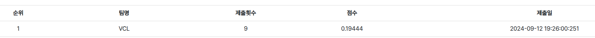

# Fashion-How-Season-5 Task4 Zero-Shot Learning

## Overview
---


본 메소드에 대한 상세한 설명은 [proposed_method.md](https://github.com/minho511/Fashion-How-Season-5/blob/main/proposed_method.md) 문서를 참고해 주세요.

## Prerequisites
---
- Ubuntu 20.04
- Python 3.8
- CUDA 11.3
- RTX 3090 GPU

Please check `requirements.txt` for other packages.

## Preparing Dataset
---
1. 대회 사이트에서 데이터셋 다운로드 [[link](https://fashion-how.org/Season5-task/?subTaskId=4)]

2. 현재 위치에 링크
    ```bash
    ln -s <path/to/data> ./data
    ```

## Training
---
```bash
sh run_train.sh
```

```bash

CUDA_VISIBLE_DEVICES="0" python3 ./main.py --mode train \
                                --in_file_trn_dialog ./data/ddata.wst.txt.2023.08.29 \
                                --in_file_fashion ./data/mdata.wst.txt.2023.08.23 \
                                --in_dir_img_feats ./data/img_feats \
                                --subWordEmb_path ./sstm_v0p5_deploy/sstm_v4p49_np_n36134_d128.dat \
                                --model_path ./model \
                                ...
```
- --model_path : 모델을 저장할 위치 입니다.  
- --epochs 40 : epoch 학습합니다.  
- --using_quantization True : 모델을 저장할때 양자화를 수행합니다.  
- 학습을 시작하면 `logs` 폴더안에 **코드를 실행한 시각**을 이름으로하는 log파일이 생성됩니다.
- model 폴더 안에 모델이 Epoch 별로 저장됩니다.

## Testing
---
```bash
sh run_test.sh
```


## Results
---

